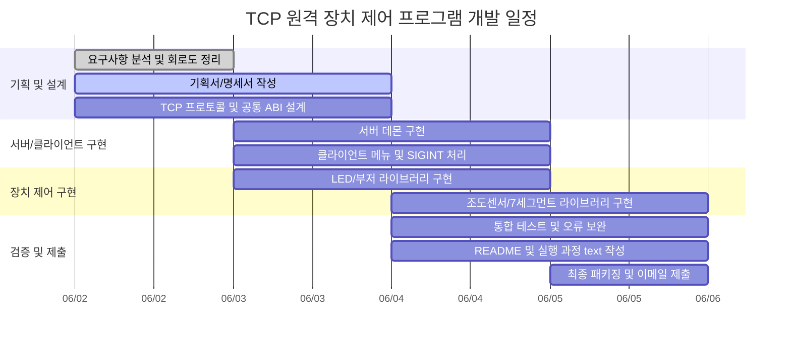

# 심화 실습 평가2(리눅스 프로그래밍) 개발 명세서 및 기획서

## 재작성 문서 링크

아래 3개 페이지가 이미지 2장과 기존 과제 요구사항을 반영하여 새로 분리 작성한 제출용 문서입니다.

* [1. 기획서 - TCP 원격 장치 제어 프로그램](https://www.notion.so/37388056fa6a81dab27aef8003ad44bd)
* [2. 개발 명세서 - TCP 서버/클라이언트 및 장치 제어](https://www.notion.so/37388056fa6a81b79352c3b1facd4ca1)
* [3. 개발문서 - 프로젝트 개요, 일정, 구현 내용, 문제점 및 보완](https://www.notion.so/37388056fa6a81569352e334c032cd4b)

---

# 1. 기획서 - TCP 원격 장치 제어 프로그램


## 문서 목적

본 기획서는 심화 실습 평가2(리눅스 프로그래밍) 과제의 요구사항과 추가 제공 회로도 2장을 기반으로, Raspberry Pi 4에서 동작하는 TCP 원격 장치 제어 프로그램의 개발 방향을 정의한다.

## 과제 요구 요약

* 실습 주제: TCP를 이용한 원격 장치 제어 프로그램
* 서버: Raspberry Pi 4
* 클라이언트: Ubuntu Linux
* 제어 대상: LED, 부저, 조도센서, 7세그먼트
* 구현 방식: 멀티 프로세스 또는 스레드 기반 장치 제어
* 구조 요구: 장치 제어 기능을 공유 라이브러리로 분리
* 서버 요구: 데몬 프로세스 형식 구성
* 클라이언트 요구: 실행 중 강제 종료 방지, SIGINT에서만 정상 종료
* 빌드 요구: make 또는 cmake 기반 자동화
* 제출물: 개발문서, 소스코드, README, 실행 과정 text 파일
## 프로젝트 콘셉트

Ubuntu Linux 클라이언트에서 사용자가 입력한 장치 제어 명령을 TCP로 Raspberry Pi 4 서버에 전달한다. Raspberry Pi 4 서버는 데몬으로 실행되며, 수신한 명령을 분석한 뒤 동적 라이브러리로 분리된 장치 제어 모듈을 호출한다.

본 프로젝트는 장치별 기능을 서버 본체와 분리하여 구현한다. LED, 부저, 조도센서, 7세그먼트 기능은 각각 독립 모듈로 작성하고, 서버는 `dlopen`, `dlsym`, `dlclose`를 이용하여 런타임에 필요한 라이브러리를 로드한다.

## 목표

* TCP 기반 원격 제어 구조를 구현한다.
* Raspberry Pi 4 GPIO와 SPI 또는 디지털 입력 회로를 이용하여 실제 장치를 제어한다.
* LED on/off 및 밝기 3단계 제어를 구현한다.
* 부저 on/off 및 7세그먼트 카운트다운 완료 시 부저 울림을 구현한다.
* 조도센서 값을 확인하고, 빛 감지 여부에 따라 LED를 자동 제어한다.
* 7세그먼트에 0~9 숫자를 표시하고 1초 단위 카운트다운을 구현한다.
* 서버는 데몬으로 동작하고, 클라이언트는 SIGINT 입력에서만 정상 종료되도록 한다.
* 빌드, 실행, 테스트 과정을 문서화하여 제출 요건을 충족한다.
## 사용자 시나리오

1. 사용자는 Raspberry Pi 4에 LED, 부저, 조도센서, 7세그먼트 회로를 연결한다.
1. 사용자는 Raspberry Pi 4에서 서버 데몬을 실행한다.
1. 사용자는 Ubuntu Linux에서 클라이언트를 실행한다.
1. 클라이언트는 서버 IP와 Port로 TCP 연결을 생성한다.
1. 사용자는 메뉴에서 장치 기능을 선택한다.
1. 클라이언트는 명령을 TCP 메시지로 서버에 전송한다.
1. 서버는 명령을 분석하고 공유 라이브러리의 장치 제어 함수를 호출한다.
1. 서버는 성공 또는 실패 응답을 클라이언트로 반환한다.
1. 사용자는 Ctrl+C를 입력하면 클라이언트가 연결을 정리하고 정상 종료한다.
## 주요 기능

### LED 제어

* LED 켜기
* LED 끄기
* 밝기 단계 제어: 최대, 중간, 최저
* 조도센서 연동 자동 제어: 어두우면 LED on, 밝으면 LED off
### 부저 제어

* 부저 켜기
* 부저 끄기
* 7세그먼트 카운트다운 종료 시 부저 울림
### 조도센서 제어

* 조도센서 현재 값 확인
* MCP3008 ADC 기반 아날로그 값 읽기 방식 지원
* GPIO22 직접 입력 기반 간소화 threshold 방식 대안 지원
* 빛 감지 여부에 따른 LED 자동 제어
### 7세그먼트 제어

* 0~9 숫자 표시
* 클라이언트가 전송한 숫자를 초 단위 시간으로 처리
* 1초마다 숫자를 1씩 감소
* 00 도달 시 부저 동작
## 회로도 반영 방향

제공된 두 회로 이미지를 다음과 같이 반영한다.


### 회로도 1: 상세 회로 구성

* LED: GPIO17, 330옴 저항, GND 연결
* 부저: GPIO27, 1k옴 베이스 저항, 10k옴 풀다운, 2N2222 트랜지스터, 5V 부저
* 조도센서: LDR과 10k옴 분압 회로를 MCP3008 ADC CH0에 연결
* MCP3008 SPI: GPIO11(SCLK), GPIO10(MOSI), GPIO9(MISO), GPIO8(CE0)
* 7세그먼트: Common Cathode 타입, 각 세그먼트에 220옴 저항 사용
### 회로도 2: 간소화 회로 구성

* LED: GPIO17 사용
* 부저: GPIO27과 2N2222 트랜지스터 드라이버 사용
* 조도센서: GPIO22 직접 입력 방식으로 단순 밝음/어두움 판정
* 7세그먼트: GPIO5, GPIO6, GPIO13, GPIO19, GPIO26, GPIO16, GPIO20, GPIO21 사용
### 구현 선택

기본 구현은 조도센서 값을 숫자로 확인할 수 있는 MCP3008 ADC 방식을 우선한다. 단, MCP3008 부품 또는 SPI 배선이 준비되지 않은 경우 GPIO22 직접 입력 방식을 대안으로 사용한다. 대안 사용 시 README와 실행 과정 파일에 '조도센서 값은 디지털 threshold 판정값으로 대체'라고 명시한다.

## 범위

### 포함 범위

* TCP 클라이언트/서버 프로그램
* Raspberry Pi 4 서버 데몬
* 장치 제어 공유 라이브러리
* LED, 부저, 조도센서, 7세그먼트 제어
* SIGINT 기반 클라이언트 종료 처리
* make 또는 cmake 빌드 자동화
* README와 실행 과정 text 파일 작성
### 제외 범위

* GUI 클라이언트
* 웹 대시보드
* 사용자 인증
* 암호화 통신
* 다중 Raspberry Pi 관리
* 장기 데이터베이스 저장
## 품질 목표

* 명령 실패 시 클라이언트에 명확한 오류 메시지를 표시한다.
* 서버는 장치 제어 실패를 로그로 남긴다.
* 하드웨어 연결 오류와 네트워크 오류를 구분한다.
* 라이브러리 교체 시 서버 본체 수정 없이 기능 업데이트가 가능해야 한다.
* 다중 클라이언트 접속 시 장치 상태 충돌을 방지한다.
## 제출 전략

* 장치별 기능을 독립적으로 테스트하고 실행 과정 text 파일에 결과를 기록한다.
* README에는 빌드 방법, 실행 방법, 핀맵, 명령어, 테스트 방법을 포함한다.
* 개발문서에는 프로젝트 개요, 개발 일정, 세부 구현 내용, 문제점 및 보완 사항을 포함한다.
* 소스코드는 서버, 클라이언트, 공통 모듈, 장치 라이브러리로 분리한다.
* 최종 제출 파일명은 `심화실습평가(리눅스 프로그래밍)_이름` 형식을 따른다.

---

# 2. 개발 명세서 - TCP 서버/클라이언트 및 장치 제어


## 시스템 구성

본 시스템은 Ubuntu Linux 클라이언트, Raspberry Pi 4 서버 데몬, 장치 제어 공유 라이브러리, GPIO/SPI 기반 하드웨어 회로로 구성한다.

```plain text
Ubuntu Client
  -> TCP Command
Raspberry Pi 4 Server Daemon
  -> Command Parser
  -> Device Manager
  -> Dynamic Libraries
  -> GPIO/SPI Hardware
```

## 개발 환경

* 언어: C
* 서버 OS: Raspberry Pi OS 또는 Debian 계열 Linux
* 클라이언트 OS: Ubuntu Linux
* 빌드 도구: make 또는 cmake
* 통신: TCP socket
* 병렬 처리: pthread 또는 fork 기반 멀티 프로세스
* 동적 라이브러리: `.so`, `dlopen`, `dlsym`, `dlclose`
* 로그: syslog 또는 파일 로그
* GPIO 제어: libgpiod, pigpio, sysfs GPIO 중 구현 환경에 맞는 방식 선택
* SPI 제어: Linux spidev 기반 MCP3008 읽기
## 권장 디렉터리 구조

```plain text
remote_device_control/
  Makefile
  README.md
  실행_과정.txt
  include/
    protocol.h
    device_api.h
    device_manager.h
    gpio_map.h
  common/
    protocol.c
    logger.c
  client/
    client.c
    menu.c
    signal_handler.c
  server/
    server.c
    daemon.c
    session.c
    device_manager.c
  devices/
    led.c
    buzzer.c
    light.c
    segment.c
  lib/
    libdevice_led.so
    libdevice_buzzer.so
    libdevice_light.so
    libdevice_segment.so
  build/
```

## 프로세스 설계

### 서버

* 서버는 데몬 프로세스로 실행한다.
* `fork`, `setsid`, `umask`, `chdir`, 표준 입출력 정리를 적용한다.
* 지정 Port에서 TCP listen socket을 생성한다.
* 클라이언트 접속을 accept 한다.
* 클라이언트별 처리 스레드 또는 프로세스를 생성한다.
* 명령을 파싱하여 장치 관리자에 전달한다.
* 장치 관리자는 공유 라이브러리 함수를 호출한다.
* 결과를 TCP 응답으로 반환한다.
### 클라이언트

* 서버 IP와 Port를 입력받는다.
* TCP socket을 생성하고 서버에 연결한다.
* 메뉴 기반 명령 입력을 제공한다.
* SIGINT 핸들러를 등록한다.
* SIGINT 발생 시 QUIT 명령을 전송하고 socket을 닫은 뒤 종료한다.
* SIGINT 외 종료 시도는 무시하거나 안내 메시지를 출력한다.
## TCP 프로토콜

모든 메시지는 줄 단위 텍스트 프로토콜로 처리한다.

### 요청 형식

```plain text
<COMMAND> <TARGET> <VALUE>\n
```

### 응답 형식

```plain text
OK <message>\n
ERR <reason>\n
VALUE <data>\n
```

### 명령 목록

```plain text
LED ON
LED OFF
LED BRIGHT HIGH
LED BRIGHT MID
LED BRIGHT LOW
BUZZER ON
BUZZER OFF
LIGHT READ
LIGHT AUTO
SEG SHOW 0
SEG SHOW 1
SEG START 9
SEG STOP
STATUS
QUIT
```

## 공유 라이브러리 명세

장치별 제어 코드는 공유 라이브러리로 분리한다.

* `libdevice_led.so`
* `libdevice_buzzer.so`
* `libdevice_light.so`
* `libdevice_segment.so`
### 공통 ABI

```c
#ifndef DEVICE_API_H
#define DEVICE_API_H

#include <stddef.h>

#define DEVICE_API_VERSION 1

typedef struct {
    int api_version;
    const char *name;
    int (*init)(void);
    int (*control)(const char *command, const char *value);
    int (*read)(char *buffer, size_t buffer_size);
    void (*cleanup)(void);
} device_api_t;

const device_api_t *device_get_api(void);

#endif
```

서버는 각 라이브러리에서 `device_get_api` 심볼을 찾아 장치별 함수 포인터를 등록한다.

## 회로 및 핀맵 명세

### LED 회로

* BCM GPIO: GPIO17
* Physical Pin: 11
* 저항: 330옴
* 연결: GPIO17 -> 330옴 -> LED Anode, LED Cathode -> GND
* 동작: GPIO HIGH에서 LED on, GPIO LOW에서 LED off
### Active Buzzer 회로

* BCM GPIO: GPIO27
* Physical Pin: 13
* 트랜지스터: 2N2222
* 베이스 저항: 1k옴
* 풀다운 저항: 10k옴
* 부저 전원: 5V
* 연결: GPIO27 -> 1k옴 -> 2N2222 Base, Base -> 10k옴 -> GND, Emitter -> GND, Collector -> Buzzer -, Buzzer + -> 5V
* 동작: GPIO27 HIGH에서 부저 on, LOW에서 off
### 조도센서 회로 A: MCP3008 ADC 방식

이 방식은 조도 값을 숫자로 읽을 수 있으므로 기본 구현 방식으로 사용한다.

* 센서: Photoresistor / LDR
* 분압 저항: 10k옴
* ADC: MCP3008
* ADC Channel: CH0
* MCP3008 VDD: 3.3V
* MCP3008 VREF: 3.3V
* MCP3008 AGND/DGND: GND
* SPI SCLK: GPIO11, Physical Pin 23
* SPI MOSI: GPIO10, Physical Pin 19
* SPI MISO: GPIO9, Physical Pin 21
* SPI CE0: GPIO8, Physical Pin 24
* 반환값: 0~1023 범위의 ADC 값
### 조도센서 회로 B: GPIO22 직접 입력 방식

이 방식은 회로도 2의 간소화 대안이다. ADC 없이 밝음/어두움 여부만 판단한다.

* BCM GPIO: GPIO22
* Physical Pin: 15
* 구성: LDR + 10k옴 저항 분압
* 동작: GPIO22 입력값으로 밝음/어두움 threshold 판정
* 제한: 아날로그 조도 숫자값은 제공하지 못한다.
### 7세그먼트 회로

* 타입: 1-Digit 7-Segment Display, Common Cathode
* 공통 단자: COM -> GND
* 각 세그먼트 저항: 220옴
* 동작: 세그먼트 GPIO HIGH에서 해당 LED segment on
### 숫자 표시 패턴

Common Cathode 기준으로 1은 on, 0은 off이다.

## 장치별 동작 명세

### LED

* `LED ON`: GPIO17 HIGH
* `LED OFF`: GPIO17 LOW

---

# 3. 개발문서 - 프로젝트 개요, 일정, 구현 내용, 문제점 및 보완


## 프로젝트 개요

본 프로젝트는 TCP 통신을 이용하여 Ubuntu Linux 클라이언트에서 Raspberry Pi 4에 연결된 장치를 원격 제어하는 리눅스 프로그래밍 실습 과제이다. 서버는 Raspberry Pi 4에서 데몬 프로세스로 동작하고, 클라이언트는 Ubuntu Linux에서 실행된다.

제어 대상 장치는 LED, Active Buzzer, Photoresistor/LDR 조도센서, 1-Digit 7-Segment Display이다. 장치 제어 로직은 공유 라이브러리로 분리하여 서버 본체와 독립적으로 관리한다.

## 하드웨어 구성 요약

### 제공 회로도 1 반영 내용

* Raspberry Pi 4 40-pin header 기준 핀 번호 사용
* LED는 GPIO17에 연결하고 330옴 저항을 사용한다.
* Active Buzzer는 GPIO27과 2N2222 트랜지스터 드라이버를 사용한다.
* LDR은 MCP3008 ADC의 CH0에 연결하고 SPI로 값을 읽는다.
* MCP3008은 3.3V 기준 전압을 사용한다.
* 7세그먼트는 Common Cathode 타입이며 각 세그먼트는 220옴 저항을 거쳐 GPIO에 연결한다.
### 제공 회로도 2 반영 내용

* LED, 부저, 7세그먼트 GPIO 핀 배치는 회로도 1과 동일하게 유지한다.
* 조도센서는 GPIO22에 직접 연결하는 단순 threshold 입력 방식도 대안으로 사용할 수 있다.
* 모든 GND는 공통으로 연결한다.
* Raspberry Pi GPIO logic level은 3.3V이므로 GPIO 입력에 5V가 직접 들어가지 않도록 한다.
## 개발 일정

## 간트 차트 일정표

아래 일정은 2026-06-05 15:00 제출을 기준으로 역산한 개발 일정이다. 핵심 기능 구현을 2026-06-04까지 완료하고, 2026-06-05 오전에는 테스트와 문서 정리에 집중한다.

### Mermaid 간트 차트

README 또는 Markdown 문서에서 사용할 수 있는 Mermaid 간트 차트는 다음과 같다.



### 일정 관리 기준

* 2026-06-02에는 요구사항과 회로를 확정하고 문서 초안을 작성한다.
* 2026-06-03에는 서버/클라이언트 기본 통신과 공유 라이브러리 ABI를 완성한다.
* 2026-06-04에는 장치별 기능 구현과 통합을 완료한다.
* 2026-06-05 오전에는 실제 보드 테스트, README, 실행 과정 text 파일을 정리한다.
* 2026-06-05 15:00 전까지 제출 파일을 압축하고 이메일로 제출한다.
## 세부 구현 내용

### 1. TCP 서버

* `socket`, `bind`, `listen`, `accept`를 이용하여 TCP 서버를 구현한다.
* 서버 실행 시 데몬화 과정을 수행한다.
* 클라이언트 연결마다 스레드 또는 프로세스를 생성한다.
* 수신한 문자열 명령을 공백 기준으로 파싱한다.
* 파싱 결과에 따라 장치 관리자에게 명령을 전달한다.
* 처리 결과를 `OK`, `ERR`, `VALUE` 형식으로 클라이언트에 응답한다.
### 2. TCP 클라이언트

* 서버 IP와 Port를 인자로 받거나 실행 중 입력받는다.
* 메뉴 기반으로 LED, 부저, 조도센서, 7세그먼트 명령을 선택한다.
* 선택한 메뉴를 TCP 프로토콜 명령으로 변환하여 서버에 전송한다.
* 서버 응답을 화면에 출력한다.
* SIGINT 핸들러를 등록하여 Ctrl+C 입력 시에만 정상 종료한다.
### 3. 공유 라이브러리

* 장치별 기능을 `.so` 파일로 빌드한다.
* 서버는 실행 중 `dlopen`으로 라이브러리를 로드한다.
* `dlsym`으로 `device_get_api` 함수를 찾는다.
* 공통 ABI를 통해 `init`, `control`, `read`, `cleanup` 함수를 호출한다.
* 라이브러리 교체 시 같은 ABI를 유지하면 서버 본체를 수정하지 않아도 된다.
### 4. LED 구현

* GPIO17을 출력으로 설정한다.
* ON/OFF는 GPIO HIGH/LOW로 처리한다.
* 밝기 조절은 PWM이 가능하면 PWM duty로 구현한다.
* PWM이 어려운 경우 소프트웨어 PWM 또는 단계별 점멸 방식으로 구현한다.
### 5. 부저 구현

* GPIO27을 출력으로 설정한다.
* HIGH 출력 시 트랜지스터가 동작하여 부저가 울린다.
* LOW 출력 시 부저가 꺼진다.
* 카운트다운 종료 이벤트를 수신하면 일정 시간 부저를 울린다.
### 6. 조도센서 구현

* 기본 방식은 MCP3008 ADC + SPI이다.
* CH0 값을 읽어 0~1023 범위 숫자값으로 반환한다.
* threshold 기준으로 밝음/어두움을 판정한다.
* 대안 방식은 GPIO22 입력값을 읽어 디지털 threshold로 판정한다.
* 자동 제어 모드에서는 어두움 판정 시 LED ON, 밝음 판정 시 LED OFF를 수행한다.
### 7. 7세그먼트 구현

* GPIO5, GPIO6, GPIO13, GPIO19, GPIO26, GPIO16, GPIO20, GPIO21을 출력으로 설정한다.
* Common Cathode 방식이므로 켜려는 segment에 HIGH를 출력한다.
* 숫자별 segment pattern table을 배열로 관리한다.
* `SEG START n` 명령에서 1초마다 값을 감소시킨다.
* 0 도달 시 부저 라이브러리를 호출하여 알림을 발생시킨다.
## 테스트 계획

## 문제점 및 보완 사항


---

