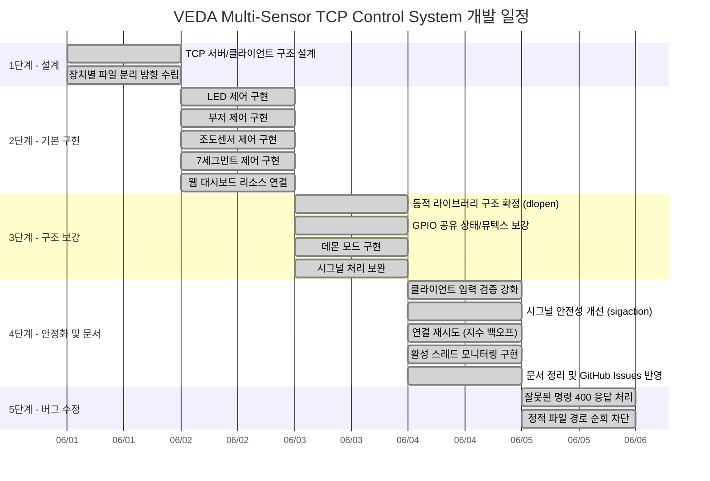
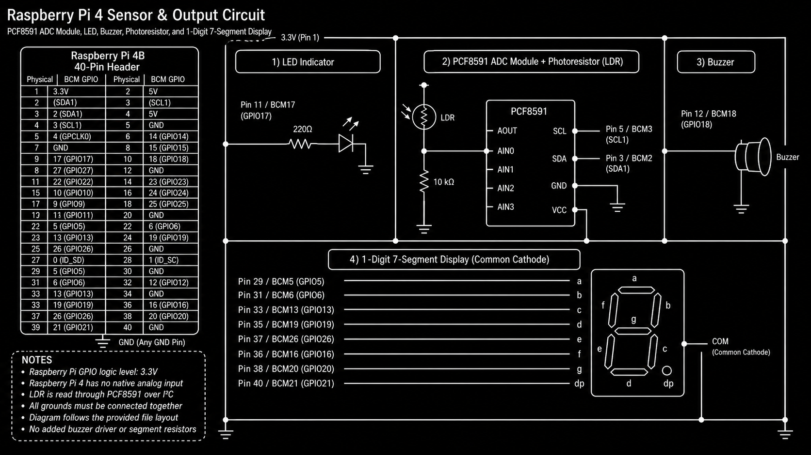

# VEDA Multi-Sensor TCP Control System

Raspberry Pi 4에서 동작하는 TCP 기반 멀티스레드 IoT 장치 제어 시스템입니다.
웹 대시보드와 CLI 클라이언트를 통해 LED, 부저, 7세그먼트, 조도센서를 원격으로 제어하고 모니터링합니다.

이 프로젝트는 `poll()` 기반 I/O 다중화, `pthread` 기반 요청 처리, `dlopen`/`dlsym` 기반 장치 드라이버 동적 로딩, GPIO 공유 상태 동기화, 데몬 실행을 학습하기 위한 시스템 프로그래밍 프로젝트입니다.

---

## 제출 문서

| 제출물 | 파일 | 내용 |
|--------|------|------|
| 개발문서 | [개발문서.md](./개발문서.md) | 프로젝트 개요, 개발 일정, 세부 구현 내용, 문제점 및 보완 사항 |
| README | [README.md](./README.md) | 소스 구조, 빌드 방법, 배포 및 실행 방법 |
| 실행 과정 문서 | [실행_과정.md](./실행_과정.md) | 빌드, 배포, 서버 실행, 웹/CLI 장치별 시연 순서 |

---

## 시연 영상

| 시연 항목 | 링크 |
|-----------|------|
| 전체 시연 | [▶ YouTube에서 보기](https://www.youtube.com/watch?v=_IDcRikB1BY) |

---

## 평가 기준 대응 요약

| 평가 항목 | 대응 내용 |
|-----------|-----------|
| LED 제어 | `/led/on`, `/led/mid`, `/led/off`, `/led/brightness?value=0..1024` 및 CLI LED 메뉴 |
| 부저 제어 | `/buzz/do` 등 계이름, 숫자 음계, 직접 주파수, `/buzz/off`, `/buzz/fein` |
| 조도센서 | `/pr` 아날로그 ADC 조회, `/pr/digital` 디지털 조회, `/pr/auto/start` 자동 LED 제어 |
| 7세그먼트 | `/segment/start`, `/segment/<0..9>`, `/segment/show/<0..9>`, `/segment/off` |
| 구현 내용 | `poll()` 연결 감시, 요청별 `pthread_detach`, 동적 라이브러리 분리, GPIO 뮤텍스, 데몬 모드, 잘못된 명령 400 응답, 경로 순회 차단 |
| 사용자 편의성 | 웹 대시보드와 CLI 클라이언트 병행 제공, `-f` 전경 디버그 모드, SIGINT 종료 처리 |
| 문서 | README, 개발문서, 실행 과정 text 파일 작성 |
| 추가 기능 | PWM 밝기 제어, FEIN 알림 멜로디, 조도 기반 서버 자동 LED 제어, 실시간 활성 스레드 모니터, GitHub Issues 기반 문제 추적 |

---

## 문서 링크

| 문서 | 링크 |
|------|------|
| 기획서 | [TCP 원격 장치 제어 프로그램](https://www.notion.so/37388056fa6a81dab27aef8003ad44bd) |
| 개발 명세서 | [TCP 서버/클라이언트 및 장치 제어](https://www.notion.so/37388056fa6a81b79352c3b1facd4ca1) |
| 개발문서 | [프로젝트 개요, 일정, 구현 내용, 문제점 및 보완](https://www.notion.so/37388056fa6a81569352e334c032cd4b) |

---

## 개발 일정



---

## 디렉토리 구조

```text
VEDA_4Sensor_TCP_Control/
├── Makefile                  # 크로스 컴파일 빌드 스크립트 (sysroot 설정 적용)
├── Makefile.simple           # 일반 환경용 단순 빌드 스크립트
├── README.md                 # 프로젝트 소개 및 빌드/실행 안내
├── 개발문서.md                # 개발 과정 및 세부 구현 문서
├── 실행_과정.md                # 빌드~시연 전체 절차
│
├── src/                      # 소스 코드
│   ├── main.c                # TCP 서버 (poll + pthread, 데몬, 동적 로딩)
│   └── client.c              # CLI 클라이언트 (Ubuntu Linux용)
│
├── include/                  # 공유 헤더 파일
│   ├── rpi_common.h          # GPIO 초기화, 뮤텍스, 공유 상태 선언
│   ├── led.h                 # LED 드라이버 인터페이스
│   ├── buzzor.h              # 부저 드라이버 인터페이스
│   ├── photoresistor.h       # 조도센서 드라이버 인터페이스
│   └── segment.h             # 7세그먼트 드라이버 인터페이스
│
├── lib/                      # 장치 드라이버 소스 (→ .so 빌드)
│   ├── rpi_common.c          # wiringPi 초기화, GPIO 뮤텍스 구현
│   ├── led.c                 # LED ON/MID/OFF/PWM 제어
│   ├── buzzor.c              # 부저 계이름/주파수/알림 멜로디
│   ├── photoresistor.c       # ADC 아날로그 + 디지털 조도 읽기
│   └── segment.c             # 7세그먼트 카운트다운/단발 표시
│
├── resources/                # 웹 대시보드 HTML
│   ├── index.html            # 메인 페이지 (장치 메뉴)
│   ├── led.html              # LED 제어 UI
│   ├── buzzer.html           # 부저 제어 UI
│   ├── segment.html          # 7세그먼트 제어 UI
│   └── pr.html               # 조도센서 조회/자동 제어 UI
│
└── docs/                     # 문서 및 이미지
    ├── images/
    │   └── raspberry-pi-4-sensor-output-circuit.png
    └── issue_report.md       # 이슈 해결 보고서
```

빌드 후 프로젝트 루트에 `server`, `client`, `lib*.so` 바이너리가 생성되며, `.gitignore`에 의해 Git 추적에서 제외됩니다.

---

## 시스템 구조

```text
Web Browser / CLI Client
        |
        | HTTP-like TCP request (:8000)
        v
src/main.c
  - poll() 기반 연결 감시
  - 요청별 detached pthread 처리
  - 정적 HTML 리소스 제공
  - 장치 제어 API 라우팅
  - 조도센서 기반 자동 LED 제어 스레드
        |
        +-- libled.so
        +-- libbuzzor.so
        +-- libsegment.so
        +-- libphotoresistor.so
        |
        v
lib/rpi_common.c / include/rpi_common.h
  - wiringPi 초기화
  - GPIO 뮤텍스
  - LED 상태 및 카운트다운 취소 플래그 공유
        |
        v
Raspberry Pi 4 GPIO / I2C
```

공유 라이브러리 파일명은 현재 코드와 동일하게 `libbuzzor.so`를 사용합니다.

---

## 멀티스레드 아키텍처

서버는 비동기식으로 다수의 요청을 동시에 처리하고 제어하기 위해 3가지 종류의 스레드로 설계되어 동작합니다.

| 스레드 타입 | 생성 및 관리 방식 | 주요 역할 및 수명 |
|-------------|-------------------|-------------------|
| **메인 스레드 (Main Thread)** | 프로세스 기동 시 기본 생성 | * `poll()`을 사용해 클라이언트 소켓 연결 수신<br>* 신규 접속 이벤트 발생 시 `clnt_connection` 스레드 생성 및 `pthread_detach`<br>* 서버 종료(`SIGINT`/`SIGTERM`) 수신 시 `auto_pr_thread`를 `join`하고, 활성 요청 스레드들이 자원을 반환할 때까지 안전하게 대기(Graceful Shutdown) |
| **클라이언트 스레드 (Client Thread)** | 연결 수신 시 `pthread_create`로 동적 생성 | * **분리 상태(Detached)**로 실행되어 스스로 메모리 자원을 정리<br>* `thread_list_mutex` 동기화 하에 전역 스레드 정보 배열(`active_threads`)에 자신의 정보(TID, Client IP, Command, Start Time)를 등록/해제<br>* 세그먼트 카운트다운(`segment/start`)과 같이 지연 시간(`delay(1000)`)이 포함된 명령 수행 시, 실행 시간만큼 스레드가 유지되어 모니터링 테이블에 실시간 노출 |
| **자동 조도 제어 스레드 (Auto PR Thread)** | `/pr/auto/start` 요청 시 `pthread_create`로 생성 | * **조인 가능 상태(Joinable)**로 생성되어 단 하나만 독립적으로 구동<br>* `auto_pr_running` 플래그가 활성화된 동안 1초 주기로 조도센서 디지털 값을 읽어 LED를 자동 제어<br>* `/pr/auto/stop` 요청 또는 서버 종료 시 플래그가 `0`으로 꺼지면서 루프 탈출 후 종료되며 `pthread_join`으로 수거됨 |

---


## 회로 구성도



실제 핀 연결 및 세그먼트 타입은 아래 핀맵과 코드 설정(`include/rpi_common.h`, `lib/segment.c`)을 우선합니다.

---

## 주요 기능

| 기능 | 설명 |
|------|------|
| 웹 대시보드 | `resources/` 아래 HTML 페이지로 LED, 부저, 7세그먼트, 조도센서를 제어 |
| CLI 클라이언트 | `client <RPI_IP>`로 서버에 접속해 장치 제어 명령 전송 |
| LED 제어 | ON, MID, OFF 및 `0~1024` 밝기 값 입력 (서버 내부에서 softPwm 0~100으로 매핑) |
| 부저 제어 | 계이름, 숫자 음계, 직접 주파수, 알림 멜로디 제어 |
| 7세그먼트 | 카운트다운, 단일 숫자 표시, OFF 요청 기반 취소 처리 |
| 조도센서 | PCF8591 I2C ADC 값 조회, 디지털 조도 값 조회, 자동 LED 제어 |
| 스레드 모니터링 | 웹 메인 대시보드에서 서버 내 비동기 활성 스레드 목록(TID, IP, 작업, Uptime)을 실시간으로 1.5초 주기 렌더링 |
| 데몬 모드 | 기본 실행 시 백그라운드 데몬으로 실행, `-f` 또는 `--foreground`로 전경 실행 |

---

## API 경로

| 경로 | 동작 |
|------|------|
| `/` | `resources/index.html` 제공 |
| `/led/on` | LED 최대 밝기 ON |
| `/led/mid` | LED 중간 밝기 |
| `/led/off` | LED OFF 및 카운트다운 취소 플래그 설정 |
| `/led/brightness?value=0..1024` | PWM 밝기 제어 |
| `/led/state` | 서버가 추적 중인 LED 상태 조회 |
| `/buzz/do`, `/buzz/re`, ... | 부저 계이름 재생 |
| `/buzz/1` ~ `/buzz/8` | 부저 숫자 음계 재생 |
| `/buzz/<frequency>` | 직접 주파수 재생 |
| `/buzz/off` | 부저 정지 |
| `/buzz/fein` 또는 `/buzz/alert` | 알림 멜로디 재생 |
| `/segment/start` | 9부터 0까지 카운트다운 |
| `/segment/<0..9>` | 지정 숫자부터 0까지 카운트다운 |
| `/segment/show/<0..9>` | 지정 숫자 단발 표시 |
| `/segment/off` | 7세그먼트 및 LED OFF |
| `/ldr/start` | `/segment/start`와 동일한 호환 경로 |
| `/pr` | PCF8591 ADC 아날로그 조도 값 조회 |
| `/pr/digital` | 디지털 조도 값 조회 |
| `/pr/auto/start` | 서버 측 자동 LED 제어 시작 |
| `/pr/auto/stop` | 서버 측 자동 LED 제어 중지 |
| `/api/threads` | 현재 활성 스레드들의 상태 목록(TID, IP, 명령어, Uptime)을 JSON 배열로 응답 |

---

## 조도센서 동작 기준

아날로그 조도 값은 `lib/photoresistor.c`의 `get_cds_value()`가 PCF8591 I2C ADC에서 읽어 옵니다.

| 값 | 기준 |
|----|------|
| ADC 값 | `0~255` 범위의 아날로그 조도 값 |
| 기본 임계값 | `threshold = 200` |
| 밝음 판단 | ADC 값이 임계값보다 작을 때 |
| 어두움 판단 | ADC 값이 임계값 이상일 때 |

디지털 조도 값은 `get_pr_value()`가 `digitalRead(PR_PIN)`으로 읽습니다.
서버 자동 LED 제어는 현재 디지털 값을 기준으로 동작합니다.

| 디지털 값 | 의미 | 자동 제어 |
|-----------|------|-----------|
| `0` / `LOW` | 어두움 | LED ON |
| `1` / `HIGH` | 밝음 | LED OFF |

---

## CLI 입력 기준

CLI 클라이언트는 메뉴 기반으로 서버 API 경로를 생성합니다.

| 메뉴 | 입력 예 | 서버 요청 |
|------|---------|-----------| 
| LED | `ON`, `MID`, `OFF`, `300` | `/led/on`, `/led/mid`, `/led/off`, `/led/brightness?value=300` |
| Buzzer | `do`, `5`, `880`, `off` | `/buzz/do`, `/buzz/5`, `/buzz/880`, `/buzz/off` |
| 7-Segment | `start`, `off`, `5`, `show/5` | `/segment/start`, `/segment/off`, `/segment/5`, `/segment/show/5` |
| Photoresistor | 메뉴 번호 `1~5` | `/pr`, `/pr/digital`, `/pr/auto/start`, `/pr/auto/stop` |

7세그먼트는 1자리 장치이므로 `0~9` 단일 자릿수만 허용합니다. `00` 같은 다중 자릿수 입력은 클라이언트에서 차단됩니다.

CLI 클라이언트의 입력 검증 현황:

| 메뉴 | 검증 내용 |
|------|-----------|
| LED | `ON`/`MID`/`OFF` 문자열 또는 `0~1024` 범위 숫자만 허용 |
| 7-Segment | `start`, `off`, `0~9`(1자리), `show/0~9`(1자리)만 허용. 그 외 입력 시 에러 메시지 출력 후 메뉴 복귀 |
| Photoresistor | 서브 메뉴 번호 `1~5` 이외 입력 시 `Invalid option` 출력 |

---

## 핀맵

| 장치 | wPi Pin | BCM GPIO | Physical Pin | 비고 |
|------|---------|----------|--------------|------|
| LED | 1 | 18 | 12 | PWM, 220Ω |
| Buzzer | 2 | 27 | 13 | softTone |
| CDS SDA | 8 | 2 | 3 | PCF8591 ADC, I2C `0x48` |
| CDS SCL | 9 | 3 | 5 | PCF8591 ADC, I2C `0x48` |
| CDS Digital | 0 | 17 | 11 | Pull-up, 10kΩ |
| 7-Segment A | 21 | 5 | 29 | Common Anode |
| 7-Segment B | 22 | 6 | 31 | Common Anode |
| 7-Segment C | 23 | 13 | 33 | Common Anode |
| 7-Segment D | 24 | 19 | 35 | Common Anode |
| 7-Segment E | 25 | 26 | 37 | Common Anode |
| 7-Segment F | 27 | 16 | 36 | Common Anode |
| 7-Segment G | 28 | 20 | 38 | Common Anode |
| 7-Segment DP | 29 | 21 | 40 | Common Anode |
| Default VCC | - | - | 1 | 3.3V |
| 7-Segment VCC | - | - | 2 | 5V |
| Default GND | - | - | 9 | GND |

---

## 빌드 환경

`Makefile`은 서버와 공유 라이브러리를 Raspberry Pi용 AArch64 바이너리로 크로스 컴파일하고, CLI 클라이언트는 호스트 PC용 `gcc`로 빌드합니다.

필요한 도구와 경로:

```bash
aarch64-linux-gnu-gcc
gcc
make
~/rpi-sysroot
~/rpi-sysroot/usr/local/include
~/rpi-sysroot/usr/local/lib
```

`~/rpi-sysroot`에는 Raspberry Pi의 wiringPi 헤더와 라이브러리가 포함되어 있어야 합니다.

---

## 빌드

빌드 환경에 따라 적합한 `Makefile`을 선택합니다.

* **개인 개발 환경 (sysroot 적용)**: 기본 제공되는 `Makefile`을 그대로 사용합니다.
* **배포 및 일반 환경 (sysroot 미적용)**: `Makefile.simple`을 복사하여 사용합니다.
  ```bash
  rm -f Makefile
  cp Makefile.simple Makefile
  ```

프로젝트 루트에서 실행합니다.

```bash
make clean && make
```

빌드 결과:

| 파일 | 설명 |
|------|------|
| `server` | Raspberry Pi에서 실행할 TCP 웹 서버 |
| `client` | 호스트 PC에서 실행할 CLI 클라이언트 |
| `libled.so` | LED 제어 드라이버 |
| `libbuzzor.so` | 부저 제어 드라이버 |
| `libphotoresistor.so` | 조도센서 드라이버 |
| `libsegment.so` | 7세그먼트 드라이버 |

---

## 배포

배포 기준 경로는 `/home/sunbi/prj`로 통일합니다.
서버는 데몬 실행 시 `/proc/self/exe`를 통해 실행 파일이 있는 디렉토리로 이동하므로, 실행 파일과 `lib*.so`, `resources/`가 같은 디렉토리 아래에 있으면 됩니다.

### 방법 A: Make 명령어로 자동 배포 (권장)

```bash
# 기본 변수(RPI_USR=sunbi, RPI_IP=192.168.0.100, RPI_DIR=/home/sunbi/prj)를 사용
make deploy

# 특정 IP, 계정, 경로를 지정하여 배포
make deploy RPI_IP=192.168.1.50 RPI_USR=pi RPI_DIR=/home/pi/myproject
```

### 방법 B: 수동 명령어로 배포

```bash
ssh sunbi@<RPI_IP> "mkdir -p /home/sunbi/prj"
scp server lib*.so sunbi@<RPI_IP>:/home/sunbi/prj/
scp -r resources sunbi@<RPI_IP>:/home/sunbi/prj/
```

---

## 실행

Raspberry Pi에서 서버를 실행합니다.

```bash
cd /home/sunbi/prj
export LD_LIBRARY_PATH=.:$LD_LIBRARY_PATH
./server
```

전경 로그를 보면서 디버깅하려면 다음 명령을 사용합니다.

```bash
cd /home/sunbi/prj
export LD_LIBRARY_PATH=.:$LD_LIBRARY_PATH
./server -f
```

호스트 PC에서 CLI 클라이언트를 실행합니다.

```bash
./client <RPI_IP>
```

웹 대시보드는 브라우저에서 다음 주소로 접속합니다.

```text
http://<RPI_IP>:8000/
```

---

## 시그널 처리

### 서버 (`src/main.c`)

| 시그널 | 처리 방식 |
|--------|-----------|
| `SIGINT`, `SIGTERM`, `SIGHUP` | `sigaction()`으로 등록. `volatile sig_atomic_t server_running` 플래그를 `0`으로 설정하여 메인 루프를 안전하게 종료 |

### 클라이언트 (`src/client.c`)

| 시그널 | 처리 방식 |
|--------|-----------|
| `SIGINT` | `sigaction()`으로 등록. `volatile sig_atomic_t server_running` 플래그 방식으로 메인 루프를 탈출한 뒤, 메인 스레드에서 `pr/auto/stop` 요청 전송 및 소켓 정리 후 안전 종료 |
| `SIGTSTP` | 무시 (`SIG_IGN`) |
| `SIGQUIT` | 무시 (`SIG_IGN`) |

서버와 클라이언트 모두 시그널 핸들러 내부에서는 `volatile sig_atomic_t` 플래그만 설정하고, I/O 작업은 메인 스레드에서 수행하여 POSIX 비동기 시그널 안전성을 준수합니다.

---

## 연결 실패 재시도

CLI 클라이언트의 `send_command()` 함수는 서버 연결 실패 시 최대 3회 시도(초기 1회 + 재시도 2회)를 지수 백오프(Exponential Backoff) 방식으로 수행합니다.

| 시도 | 대기 시간 |
|------|-----------|
| 1차 시도 실패 | 1초 대기 후 재시도 |
| 2차 시도 실패 | 2초 대기 후 재시도 |
| 3차 시도 실패 | 에러 메시지 출력 후 메뉴 복귀 |

---

## 이슈 트래킹

프로젝트 개발 중 발견된 버그와 개선 사항은 [GitHub Issues](https://github.com/DevSunbi/VEDA_4Sensor_TCP_Control/issues)에서 관리합니다.

| 이슈 리포트 | 내용 |
|-------------|------|
| [issue_report.md](./docs/issue_report.md) | Active Thread Monitor API 중첩 오류 해결 |
| [issue_report_response_code.md](./docs/issue_report_response_code.md) | 잘못된 명령 400 응답 및 경로 순회 차단 |

---

## 해결된 추가 이슈

| 항목 | 설명 |
|------|------|
| 잘못된 명령에 200 OK 반환 | 장치 라이브러리 반환 타입을 `void` → `int`로 변경하여 실패 시 `400 Bad Request`를 반환하도록 수정 |
| 정적 파일 경로 순회 취약점 | `sendData()`에서 `..` 경로를 차단하고, 파일 열기 성공 후에 200 OK 헤더를 전송하도록 순서 변경 |

## 알려진 보완 지점

| 항목 | 설명 |
|------|------|
| 조도센서 자동 제어 종료성 | `cdsControl()`은 무한 루프 구조이므로 서버 자동 제어는 `get_pr_value()`를 주기 호출하는 방식으로 대체되어 있습니다. |
| 카운트다운 정밀도 | `delay(1000)`과 GPIO 뮤텍스 재획득 타이밍에 따라 지터가 생길 수 있습니다. |
| 라이선스 파일 | README에는 MIT License로 표기되어 있으나, 별도 `LICENSE` 파일 추가를 권장합니다. |

---

## 동적 라이브러리 업그레이드 방식 (Hot-swapping)

- **요청 기반 실시간 로드 (On-Demand Loading)**: 서버는 구동 시점에 라이브러리를 영구 로드하지 않고, 클라이언트의 요청이 발생하거나 제어 루프가 실행될 때마다 `dlopen()`을 통해 `.so` 파일을 메모리에 올리고 제어 완료 시 `dlclose()`로 즉시 내립니다.
- **무중단 실시간 반영**: 서버가 실행 중인 상태에서 새로운 기능이 적용된 `.so` 라이브러리 파일을 빌드 및 덮어쓰기하면, **서버 재시작이나 릴로드 조작 없이 다음 장치 제어 요청 시점부터 즉시 새로운 기능이 무중단(Hot-swap)으로 반영**됩니다.

---

## 라이선스 및 개발자 정보

| 항목 | 내용 |
|------|------|
| 개발자 | sunbi, VEDA 4기 |
| 목적 | Raspberry Pi 4 환경에서 TCP 통신, 동적 라이브러리 로딩, 멀티스레드 GPIO 제어 학습 |
| 라이선스 | MIT License |
